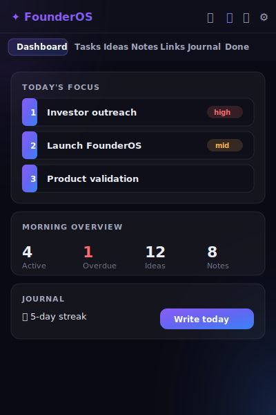
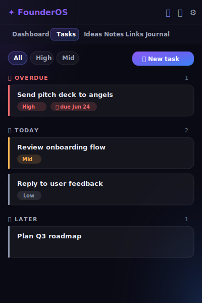
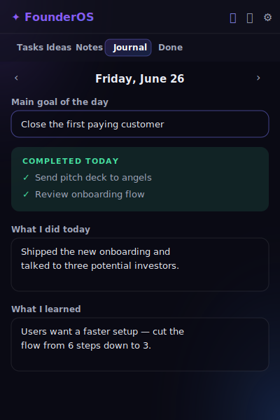
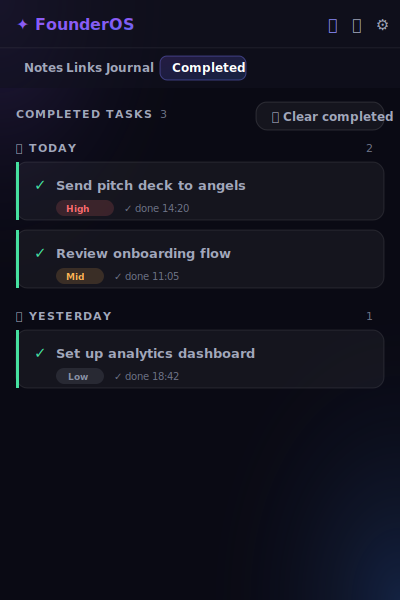

# 🚀 FounderOS

### A lightweight personal operating system for founders.

Tasks, ideas, notes, links and a daily journal — all in one fast, distraction-free Chrome extension.
**100% local. No accounts. No tracking. No cloud.**

---

## ✨ Why FounderOS?

Founders juggle a hundred things a day. Most productivity apps are heavy, cloud-bound and beg for your attention. FounderOS does the opposite: it lives one click away in your toolbar, opens instantly, keeps everything on your machine, and gets out of your way.

> Maximum usefulness, minimum clicks.

---

## 🧩 Features

- 🏠 **Dashboard** — *Today's Focus* (your 3 key tasks), a morning overview and compact recent widgets.
- 📋 **Tasks** — deadlines, importance levels, automatic time grouping (Overdue / Today / Tomorrow / Later), filters and **drag & drop** reordering.
- 💡 **Ideas** — capture ideas, pin the best ones to a dedicated block on top.
- 📝 **Notes** — rich plain-text notes with pin, search and **draft autosave**.
- 🔗 **Links** — your personal resource library. Save **the page you're on in one click**, plus a pinned block.
- 📔 **Daily Journal** — main goal of the day, auto-pulled list of tasks you completed, and reflection prompts; navigate any day.
- ✅ **Completed** — a dedicated log of finished tasks, **grouped by the day they were done**, with one-click clear-to-archive. Active tasks stay clean.
- 📦 **Archive** — archived items in one place, restore or delete.
- 🔍 **Global Search** — search across tasks, ideas, notes, links and journal at once.
- ⚡ **Quick Capture** — a `+` button (and keyboard shortcuts) to add anything in seconds.
- 🎙️ **Voice Input** — optional dictation via the free, browser-native Web Speech API.
- 🌐 **Language Switching** — English & Русский, instant toggle, remembered.
- 💾 **Import / Export** — back up or move all your data as JSON.
- 🌌 **Neon Glass UI** — frosted-glass panels, a violet→blue gradient accent, and a tasteful animation for every action (respects reduced-motion).

---

## 📸 Screenshots

| Dashboard | Tasks |
| --- | --- |
|  |  |

| Journal | Completed |
| --- | --- |
|  |  |

---

## 📥 Installation

FounderOS installs in under a minute and needs **no build step, no npm, no account**.

1. **Download the project.** Click the green **Code → Download ZIP** button on GitHub, then unzip it. (Or `git clone` the repo.)
2. Open Google Chrome and go to **`chrome://extensions`** (type it into the address bar).
3. Turn on **Developer mode** using the toggle in the top-right corner.
4. Click **Load unpacked**.
5. Select the **FounderOS** folder you just unzipped (the one containing `manifest.json`).
6. Done! Click the FounderOS icon in your toolbar to open it. Pin it for quick access.

> Works in any Chromium-based browser (Chrome, Edge, Brave, Arc) that supports Manifest V3.

---

## 📖 Usage

- **Create a task** — open Tasks → **New task**, or press `T` anywhere. Set a deadline and importance; it’s grouped automatically.
- **Focus your day** — on any task, click the ☆ to add it to **Today's Focus** (up to 3) shown on the Dashboard.
- **Reorder tasks** — drag the handle on the left of a task card.
- **Capture an idea** — press `I` or use the `+` button. Pin great ideas to keep them on top.
- **Take notes** — press `N`. Your text autosaves as a draft every couple of seconds, so nothing is lost.
- **Save a link** — press `L`, or in Links click **Add this page** to save the tab you’re on in one click.
- **Journal** — press the Journal tab, write your day. Tasks you completed that day appear automatically.
- **Completed** — open the Completed tab to see finished tasks grouped by day; **Clear completed** sweeps them into the Archive.
- **Search** — press `/` and type; results are grouped by type.
- **Switch language** — use the `EN`/`RU` toggle in the top-right corner.
- **Voice input** — tap the 🎤 next to a field (shown only if your browser supports it).
- **Expand** — click the expand icon to open FounderOS in a full browser tab for longer sessions.

### ⌨️ Keyboard Shortcuts

| Key | Action |
| --- | --- |
| `t` | New task |
| `i` | New idea |
| `n` | New note |
| `l` | New link |
| `/` | Focus search |
| `Esc` | Close dialog |

*(Shortcuts are ignored while you’re typing in a field.)*

---

## 💾 Data Storage

All your data is stored **locally** in your browser via `chrome.storage.local`. Nothing is ever uploaded. There are no servers, no APIs and no analytics. Use **Settings → Export** to create a JSON backup at any time, and **Import** to restore it on another machine.

---

## 🔒 Privacy First

- ✅ **100% Local** — data never leaves your device.
- ✅ **No Tracking** — zero analytics, zero telemetry.
- ✅ **No Cloud Storage** — nothing is synced anywhere.
- ✅ **No External APIs** — no paid keys, no third-party calls.
- ✅ **No Account** — just install and use.

---

## 🛡️ Security

FounderOS is a fully client-side, open-source extension. It requests only two permissions:

- `storage` — to save your data locally.
- `tabs` — to read the active tab’s URL and title for the **“Add current tab”** link shortcut.

There are no external network requests, no remote code, and no secrets in the repository.

---

## 🗺️ Roadmap

Planned features (kept intentionally simple — **no AI, no bloat**):

- [ ] Subtasks / checklists for tasks
- [ ] Tags and tag filtering
- [ ] Markdown rendering in notes
- [ ] Weekly journal review summary (local stats only)
- [ ] Additional interface languages
- [ ] Per-section keyboard navigation

---

## 🤝 Contributing

Contributions are welcome! Please read [CONTRIBUTING.md](CONTRIBUTING.md) for guidelines on the project structure, coding style and how to submit changes.

---

## 📄 License

[MIT](LICENSE) © FounderOS contributors.
